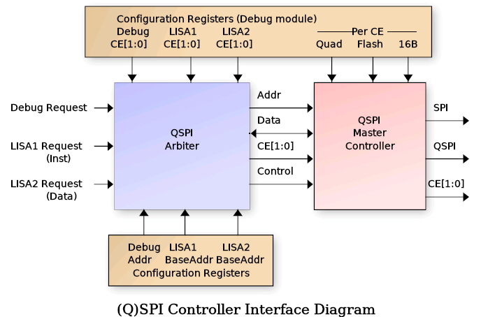

## What is LISA?
                                 
It is a Microcontroller built around a custom 8-Bit Little ISA (LISA)
microprocessor core.  It includes several standard peripherals that
would be found on commercial microcontrollers including timers, GPIO,
UARTs and I2C.
The following is a block diagram of the LISA Microcontroller:

   - The LISA Core has a minimal set of register that allow it to run C programs:
      - Program Counter + Return Address Resister
      - Stack Pointer and Index Register (Indexed DATA RAM access)
      - 8-bit Accumulator + 16-bit BF16 Accumulator and 4 BF16 registers

### Deailed list of the features
   - Harvard architecture LISA Core (16-bit instruction, 15-bit address space)
   - Debug interface
      * UART controlled
      * Auto detects port from one of 3 interfaces
      * Auto detects the baud rate
      * Interfaces with SPI / QSPI SRAM or FLASH
      * Can erase / program the (Q)SPI FLASH
      * Read/write LISA core registers and peripherals
      * Set LISA breakpoints, halt, resume, single step, etc.
      * SPI/QSPI programmability (single/quad, port location, CE selects)
   - (Q)SPI Arbiter with 3 access channels
      * Debug interface for direct memory access
      * Instruction fetch
      * Data fetch
      * Quad or Single SPI.  Hereafter called QSPI, but supports either.
   - Onboard 128 Byte RAM for DATA / DATA CACHE
   - Data bus CACHE controller with 8 16-byte CACHE lines
   - Instruction CACHE with a single 4-instruction CACHE line
   - Two 16-bit programmable timers (with pre-divide)
   - Debug UART available to LISA core also
   - Dedicated UART2 that is not shared with the debug interface
   - 8-bit Input port (PORTA)
   - 8-bit Output port (PORTB)
   - 4-bit BIDIR port (PORTC)
   - I2C Master controller
   - Hardware 8x8 integer multiplier
   - Hardware 16/8 or 16/16 integer divider
   - Hardware Brain Float 16 (BF16) Multiply/Add/Negate/Int16-to-BF16
   - Programmable I/O mux for maximum flexibility of I/O usage.

It uses a 32x32 1RW [DFFRAM](https://github.com/AUCOHL/DFFRAM) macro to implement a 128 bytes (1 kilobit) RAM module.
The 128 Byte ram can be used either as a DATA cache for the processor data bus, giving a 32K Byte address range,
or the CACHE controller can be disabled, connecting the Lisa processor core to the RAM directly, limiting the 
data space to 128 bytes.  Inclusion of the DFFRAM is thanks to Uri Shaked (Discord urish) and this DFFRAM example.

Reseting the project **does not** reset the RAM contents.

## Connectivity

All communication with the microcontroller is done through a UART connected to the Debug Controller.  The UART
I/O pins are auto-detected by the debug_autobaud module from the following choices (RX/TX):

    ui_in[3]  / ui_out[4]     RP2040 UART interface   
    uio_in[4] / uio_out[5]    LISA PMOD board (I am developing)
    uio_in[6] / uio_out[5]    Standard UART PMOD

The RX/TX pair port is auto-detected after reset by the autobaud circuit, and the UART baud rate can either be
configured manually or auto detected by the autobaud module.  After reset, the ui_in[7] pin is sampled to determine
the baud rate selection mode.  If this input pin is HIGH, then autobaud is disabled and ui_in[6:0] is sampled as
the UART baud divider and written to the Baud Rate Generator (BRG).  The value of this divider should be: clk_freq / baud_rate / 8 - 1.
Due to last minute additions of complex floating point operations, and only 2 hours left on the count-down clock, the timing
was relaxed to 20MHz input clock max.  So for a 20MHz clock and 115200 baud, the b_div[6:0] value would be 42 (for instance).

If the ui_in[7] pin is sampled LOW, then the autobaud module will monitor all three potential RX input pins for LINEFEED
(ASCII 0x0A) code to detect baud rate and set the b_div value automatially.  It monitors bit transistions and searches for three
successive bits with the same bit period.  Since ASCII code 0x0A contains a "0 1 0 1 0" bit sequence, the baud rate can be detected easily.

Regardless if the baud rate is set manually or using autobaud, the input port selection will be detect automatically 
by the autobaud.  In the case of manual buad rate selection, it simply looks for the first transition on any of the
three RX pins.  For autobaud, it select the RX line with three successive eqivalent bit periods.

### Debug Interface Details

The Debug interface uses a fixed, verilog coded Finite State Machine (FSM) that supports a set of commands over
the UART to interface with the microcontroller.  These commands are simple ASCII format such that low-level testing
can be performed using any standard terminal software (such as minicom, tio. Putty, etc.).  The 'r' and 'w' commands must be
terminated using a NEWLINE (0x0A) with an optional CR (0x0D).  Responses from the debug interface are always 
terminated with a LINFEED plus CR sequence (0x0A, 0x0D).  The commands are as follows (responsce LF/CR ommited):

Command  Description
-------  -----------
v        Report Debugger version.  Should return: lisav1.2
wAAVVVV  Write 16-bit HEX value 'VVVV' to register at 8-bit HEX address 'AA'.
rAA      Read 16-bit register value from 8-bit HEX address 'AA'.
t        Reset the LISA core.
l        Grant LISA the UART.  Further data will be ignored by the debugger.
+++      Revoke LISA UART access.  NOTE: a 0.5s guard time before/after is required.

NOTE: All HEX values must be a-f and not A-F.  Uppercase is not supported.

### Debug Configuration and Control Registers

The following table describes the configuration and LISA debug register addresses available via the debug 'r' and 'w'
commands.  The individual register details will be described in the sections to follow.
                                                                      
ADDR  Description                  ADDR  Description 
----  -----------                  ----  -----------                                                             
0x00  LISA Core Run Control        0x12  LISA1 QSPI base address                                                                                   
0x01  LISA Accumulator / FLAGS     0x13  LISA2 QSPI base address                                                 
0x02  LISA Program Counter (PC)    0x14  LISA1 QSPI CE select                     
0x03  LISA Stack Pointer (SP)      0x15  LISA2 QSPI CE select                     
0x04  LISA Return Address (RA)     0x16  Debug QSPI CE select                     
0x05  LISA Index Register (IX)     0x17  QSPI Mode (QUAD, flash, 16b)             
0x06  LISA Data bus                0x18  QSPI Dummy read cycles                   
0x07  LISA Data bus address        0x19  QSPI Write CMD value                     
0x08  LISA Breakpoint 1            0x1a  The '+++' guard time count               
0x09  LISA Breakpoint 2            0x1b  Mux bits for uo_out                      
0x0a  LISA Breakpoint 3            0x1c  Mux bits for uio                         
0x0b  LISA Breakpoint 4            0x1d  CACHE control                            
0x0c  LISA Breakpoint 5            0x1e  QSPI edge / SCLK speed                   
0x0d  LISA Breakpoint 6            0x20  Debug QSPI Read / Write                  
0x0f  LISA Current Opcode Value    0x21  Debug QSPI custom command                
0x10  Debug QSPI Address (LSB16)   0x22  Debug read SPI status reg                
0x11  Debug QSPI Address (MSB8)                                                   

### LISA Processor Interface Details

The LISA Core requires external memory for all Instructions and Data (well, sort of for data).  To
accomodate this, the design uses a QSPI controller that is configurable as either single SPI or
QUAD SPI, Flash or SRAM access, 16-Bit or 24-Bit addressing, and selectable Chip Enable for each
type of access.  To achieve this, a QSPI arbiter is used to allow multiple accessors as shown in
the following diagram:

The arbiter is controlled via configuration registers (accessible by the Debug controller)
that specify the operating mode per CE, and CE selection bits for each of the three interfaces:

   
   - Debug Interface
   - LISA1 (Instruction fetch)
   - LISA2 (Data read/write)

The arbiter gives priority to the Debug accesses and processes LISA1 and LISA2 requests using
a round-robbin approach.  Each requestor provides a 24-bit address along with 16-bit data read/write.
For the Debug interface, the address comes from the configuration registers directly.  For LISA1,
the address is the Program Counter (PC) + LISA1 Base and for LISA2, it is the Data Bus address +
LISA2 Base.  The LISA1 and LISA2 base addresses are programmed by the Debug controller and set the 
upper 16-bits in the 24-bit address range.  The PC and Data address provide the lower 16 bis (8-bits
overlapped that are 'OR'ed together).  The BASE addresses allow use of a single external QSPI SRAM
for both instruction and data without needing to worry about data collisions.

When the arbiter chooses a requestor, it passes its programmed CE selection to the QSPI controller.  The
QSPI controller then uses the programmed QUAD, MODE, FLASH and 16B settings for the chosen CE to process the
request.  This allows LISA1 (Instruction) to either execute from the same SRAM as LISA2 (Data) or to
execute from a separate CE (such as FLASH with permanent data storage).

Additionally the Debug interface has special access registers in the 0x20 - 0x22 range that allow 
special QSPI accesses such as FLASH erase and program, SRAM programming, FLASH status read, etc.  In
fact the Debug controller can send any arbitrary command to a target device, using access that either
provide an associated address (such as erase sector) or no address.  The proceedure for this is:

  1.  Program Debug register 0x19 with the special 8-bit command to be sent
  2.  Set the 9-th bit (reg19[8]) to 1 if a 16/24 bit address needs to be sent)
  3.  Perform a read / write operation to debug address 0x21 to perform the action.

Simple QSPI data reads/write are accomplished via the Debug interface by setting the desired address
in Debug config register 0x10 and 0x11, then performing read or write to address 0x20 to perform the request.
Reading from Debug config register 0x22 will perform a special mode read of QSPI register 0x05 (the FLASH
status register).

Data access to the QSPI arbiter from from the Data CACHE interface, enabling a 32K address space for data.  However
the design has a CACHE disable mode that directs all Data accesses directly to the internal 128 Byte SRAM, thus
eliminating the need for external SRAM (and limiting the data bus to 128 bytes).

### Programming the QSPI Controller

Before the LISA microcontroller can be used in any meaningful manner, a SPI / QSPI SRAM (and optionally a NOR FLASH) must
be connected to the Tiny Tapeout PCB.  Alternately, the RP2040 controller on the board can be configured to emulate a
single SPI (the details for configuring this are outside the scope of this documentation ... search the Tiny Tapeout
website for details.).  For the CE signals, there are two operating modes, fixed CE output and Mux Mode 3 "latched" CE
mode.  Both will be described here.  The other standard SPI signals are routed to dedicated pins as follows:
  
Pin     SPI     QSPI  Notes
----    ---     ----  -----
uio[0]  CE0     CE0
uio[1]  MOSI    DQ0   Also MOSI prior to QUAD mode DQ0
uio[2]  MISO    DQ1   Also MISO prior to QUAD mode DQ1
uio[3]  SCLK    SCLK
uio[4]  CE1     CE1   Must be enabled via uio MUX bits
uio[6]   -      DQ2   Must be enabled via uio MUX bits
uio[7]   -      DQ3   Must be enabled via uio MUX bits

For Special Mux Mode 3 (Debug register 0x1C uio_mux[7:6] = 2'h3), the pinout is mostly the same except the CE signals are not constant.
Instead they are "latched" into an external 7475 type latch.  This mode is to support a PMOD board connected to the uio
PMOD which supports a QSPI Flash chip, a QSPI SRAM chip, and either Debug UART or I2C.  For all of that functionality, 
nine pins would be required for continuous CE0/CE1, however only eight are available.  So the external PMOD uses uio[0] as a
CE "latch" signal and the CE0/CE1 signals are provided on uio[1]/uio[2] during the latch event.  This requires a series
resistor as indicated to allow CE updates if the FLASH/SRAM is driving DQ0/DQ1.  The pinout then becomes:

Pin     SPI/QSPI             Notes
----    ---                  -----
uio[0]  ce_latch             ce_latch HIGH at beginning of cycle
uio[1]  ce0_latch/MOSI/DQ0   Connection to FLASH/SRAM via series resistor
uio[2]  ce1_latch/MISO/DQ1   Connection to FLASH/SRAM via series resistor
uio[3]  SCLK               
uio[6]  -/DQ2                Must be enabled via uio MUX bits
uio[7]  -/DQ3                Must be enabled via uio MUX bits

This leaves uio[4]/uio[5] available for use as either UART or I2C.

Once the SPI/QSPI SRAM and optional FLASH have been chosen and connected, the Debug configuration registers must
be programmed to indicate the nature of the external device(s).  This is accompilished using Debug registers 0x12 - 0x19 and
0x1C.  To programming the proper mode, follow these steps:

   1. Program the LISA1, LISA2 and Debug CE Select registers (0x14, 0x15, 0x16) indicating which CE to use.
      -  0x14, 0x15, 0x16:  {6'h0, ce1_en, ce0_en} Active HIGH
\clearpage
   2. Program the LISA1 and LISA2 base addresses if they use the same SRAM:
      -  0x12: {LISA1_BASE, 8'h0} | {8'h0, PC}
      -  0x13: {LISA2_BASE, 8'h0} | {8'h0, DATA_ADDR}
   3. Program the mode for each Chip Enable (bits active HIGH)
      -  0x17: {10'h0, is_16b[1:0], is_flash[1:0], is_quad[1:0]}
   4. For Quad SPI, Special Mux Mode 3, or CE1, program the uio_mux mode:
      -  0x1C:
         * [7:6] = 2'h2: Normal QSPI DQ2 select
         * [7:6] = 2'h3: Special Mux Mode 3 (Latched CE)
         * [5:4] = 2'h2: Normal QSPI DQ3 select
         * [5:4] = 2'h3: Special Mux Mode 3
         * [1:0] = 2'h2: CE1 select on uio[4]
   5. For RP2040, you might need to slow down the SPI clock / delay between successive CE activations:
      -  0x1E:
         * [3:0] spi_clk_div: Number of clocks SCLK HIGH and LOW
         * [10:4] ce_delay: Number clocks between CE activations
         * [12:11] spi_mode: Per-CE FALLING SCLK edge data update
   6. Set the number of DUMMY ready required for each CE:
      -  0x18: {8'h0, dummy1[3:0], dummy0[3:0]
   7. For QSPI FLASH, set the QSPI Write opcode (it is different for various Flashes):
      -  0x19: {8'h0, quad_write_cmd}

\clearpage

## Architecture Details

The following is a simplified block diagram of the LISA processor core:

## How to test

You will need to download and compile the C-based assembler, linker and C compiler I wrote (will make available)
Also need to download the Python based debugger.

  - Assembler is fully functional
    - Includes limited libraries for crt0, signed int compare, math, etc.
    - Libraries are still a work in progress
  - Linker is fully functional
  - C compiler is functional (no float support at the moment) but is a work in progress.
  - Python debugger can erase/program the FLASH, program SPI SRAM, start/stop the LISA core, read SRAM and registers.

\clearpage
### Legend for Pinout

  - pa: LISA GPIO PortA Input
  - pb: LISA GPIO PortB Output
  - b_div: Debug UART baud divisor sampled at reset
  - b_set: Debug UART baud divisor enable (HIGH) sampled at reset
  - baud_clk: 16x Baud Rate clock used for Debug UART baud rate generator
  - ce_latch: Latch enable for Special Mux Mode 3 as describe above
  - ce0_latch: CE0 output during Special Mux Mode 3 
  - ce1_latch: CE1 output during Special Mux Mode 3 
  - DQ1/2/3/4: QUAD SPI bidirection data I/O
  - pc_io: LISA GPIO Port C I/O (direction controllable by LISA)
